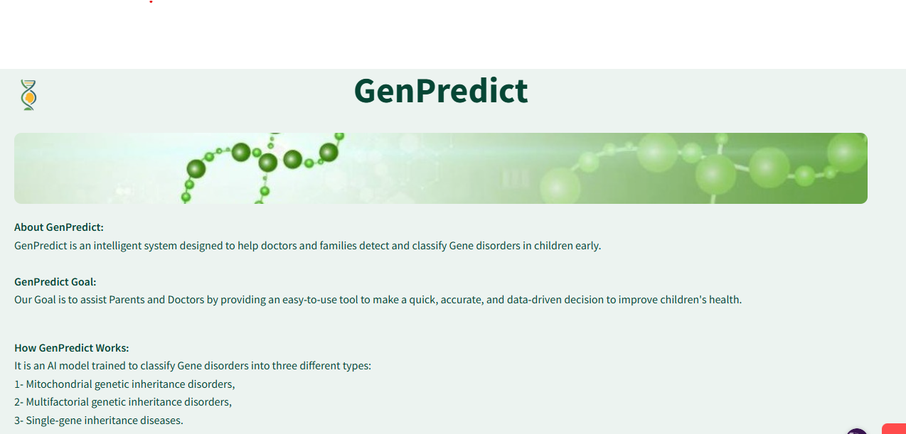

# 🧬 GenPredict  
GenPredict is an AI-powered prediction model designed to support early detection of genetic disorders in children.  
By analyzing key medical and inherited risk factors, GenPredict helps families and healthcare professionals take proactive steps toward early diagnosis and prevention.

## 🛠️ Tools & Technologies

| Category | Tools |
|---------|------|
| Data Processing | Pandas, NumPy, Scikit-learn |
| Visualization | Matplotlib, Seaborn |
| Development Environment | Jupyter Notebook, VS Code |
| Application | Streamlit |
| Version Control | Git & GitHub |

## 🤖 Model Architecture

We used an **Ensemble Voting Classifier** that combines:
- **Extra Trees Classifier**
- **Support Vector Machine (SVM)**

This method improves prediction performance and robustness across multiple disorder types. 

### 🔬 Model Classification Capabilities
GenPredict AI model is trained to classify gene disorders into **three different types**:

1️⃣ **Mitochondrial genetic inheritance disorders**  
2️⃣ **Multifactorial genetic inheritance disorders**  
3️⃣ **Single-gene inheritance diseases**

## 🖥️ GenPredict Website
### 📸 Main Page Screenshot

### 📸 Prediction Page Screenshot

### 📸 Prediction Result Screenshot

You can try the GenPredict web here 👇  
🔗 https://genpredict-website-zbffqzryrhbftp98apk5pb.streamlit.app/

## 👥 Team

| Name | Linkedin |
|------|------|
| Bashyer Alsulami | https://www.linkedin.com/in/bashyer-alsulami |
| Shahad Alhamam | https://www.linkedin.com/in/shahad-alhamam |
| Shahad Altalhi | https://www.linkedin.com/in/altalhishahd |
| Shahad Alfahmi | http://linkedin.com/in/shahad-alfahmi-390729312 |

